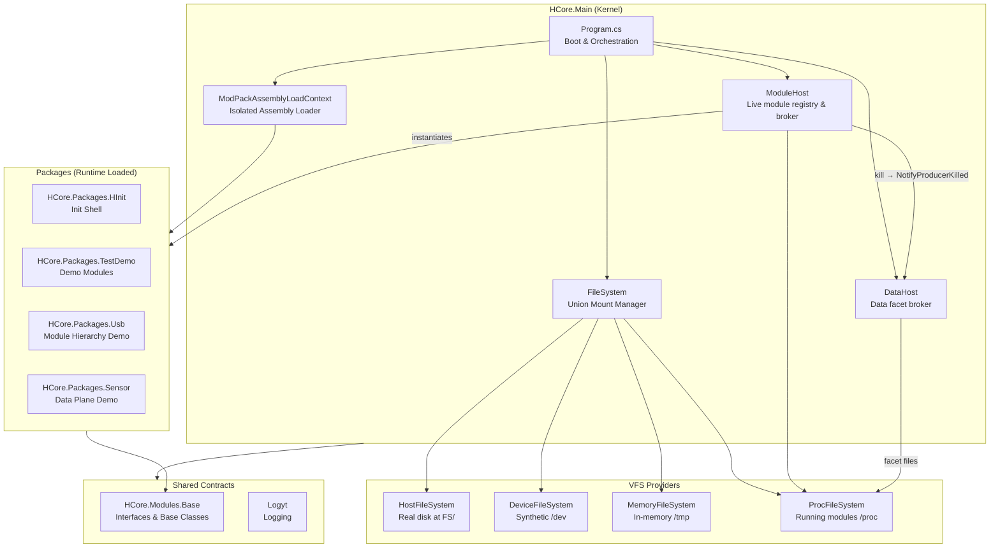
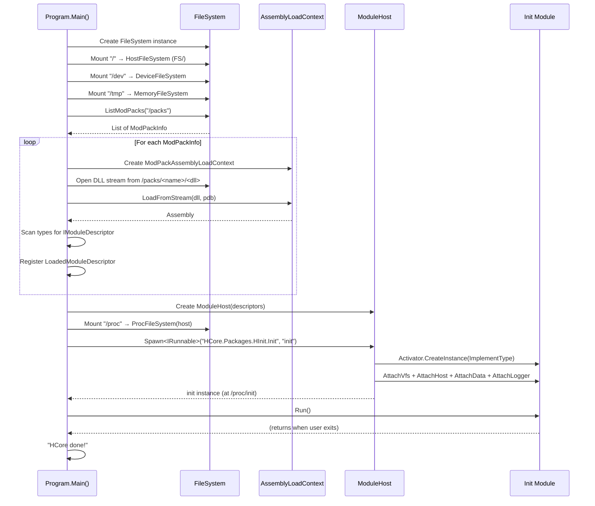
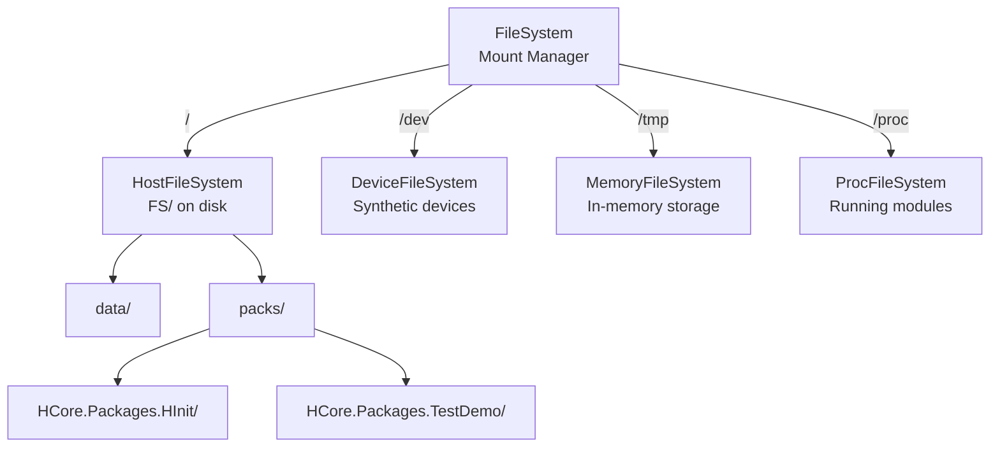
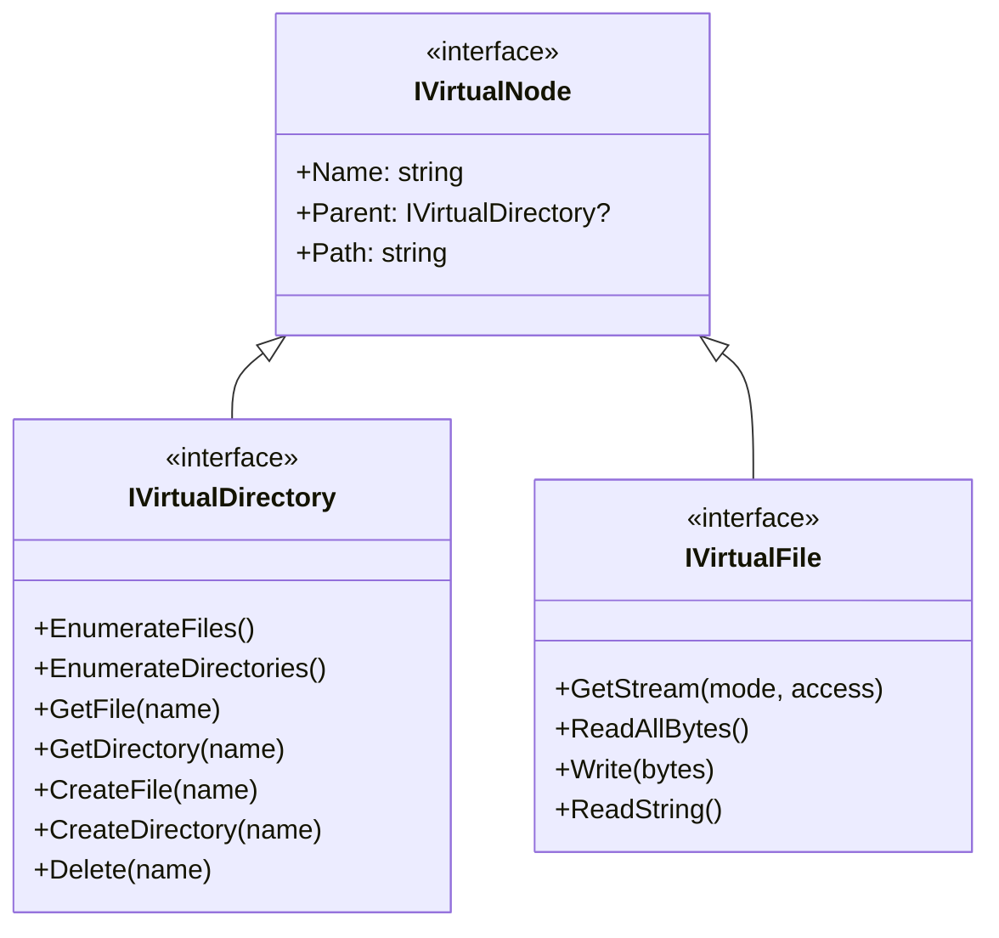
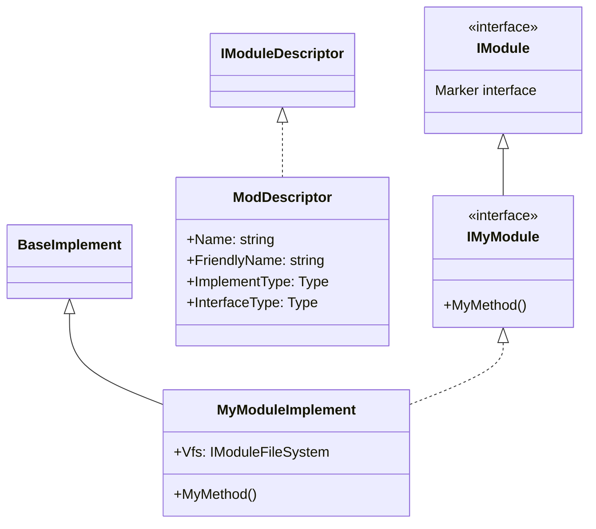
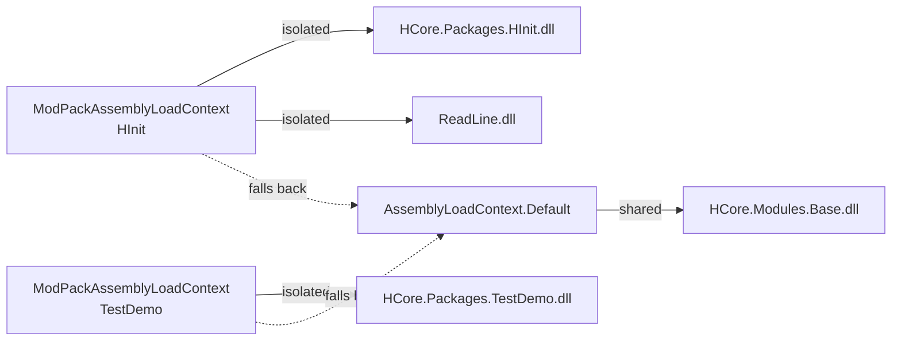
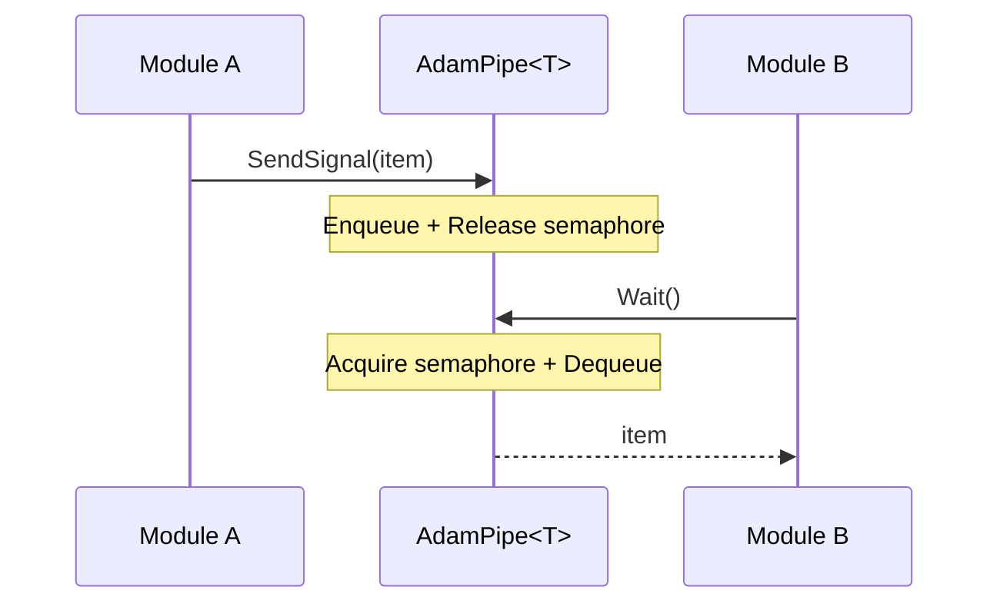

# Architecture

This document describes the internal architecture of HCore — its boot sequence, virtual file system, module loading mechanism, and inter-module communication.

## High-Level Overview



## Kernel Space, User Space & System Calls

HCore draws a hard line between the **kernel** and the **modules**, enforced by assembly references and `AssemblyLoadContext` isolation:

- **Kernel space** — `HCore.Main`. Holds the real `FileSystem`, the `ModuleHost` (the process table), the assembly loaders, and the mount table. It is privileged: it can touch the disk, create instances, and mount filesystems. Modules may **never** reference `HCore.Main`.
- **User space** — the `HCore.Packages.*` modules. Each loads into its own isolated `AssemblyLoadContext` and may reference **only** `HCore.Modules.Base`. A module has **no ambient access** to the kernel — it cannot `new FileSystem()` or read the instance table.

### The system-call interface

The only way a module reaches the kernel is through interfaces that are (a) declared in the shared `HCore.Modules.Base` contract and (b) implemented by the kernel and **injected** into the module on creation. These injected objects are HCore's equivalent of the system-call trap:

| Module sees (user space) | Kernel provides (kernel space) | Syscall group |
|--------------------------|--------------------------------|---------------|
| `BaseImplement.Vfs : IModuleFileSystem` | `ModuleFileSystemProxy` → `FileSystem` | file calls: open / read / write / list … |
| `BaseImplement.Host : IModuleHost` | `ModuleHost` | process / IPC calls: get / spawn / resolve |
| `BaseImplement.Data : IDataHost` | `DataHost` | data calls: expose / read / subscribe (live data facets) |
| `BaseImplement.Logger : IModuleLogger` | `ModuleLogger` | log calls: I / W / E |

A module makes a "syscall" simply by calling a method on `Vfs`, `Host`, `Data`, or `Logger`. Because the implementation lives in the kernel and only a contract type crosses the boundary, a module cannot escalate beyond what those interfaces expose — the injected handles **are** its capabilities. Adding a new kernel capability (e.g. `Spawn`) is therefore exactly "adding a new system call": declare it on the relevant interface (`IModuleHost`, `IDataHost`, …), implement it in the kernel.

## Boot Sequence

The entire system starts from `Program.Main()` in `HCore.Main`:



### Step-by-step

1. **Create logger** — `ConsoleLogyt("HCore")` for kernel-level logging
2. **Create VFS** — Empty `FileSystem` instance (union mount manager)
3. **Mount filesystems**:
   - `/` → `HostFileSystem` pointing to the physical `FS/` directory
   - `/dev` → `DeviceFileSystem` (synthetic, read-only)
   - `/tmp` → `MemoryFileSystem` (in-memory, volatile)
4. **Discover packages** — Enumerate directories under `/packs`, read each `mpd` file to get DLL/PDB names
5. **Load assemblies** — For each package, create an isolated `ModPackAssemblyLoadContext`, load the DLL from the VFS stream
6. **Scan for modules** — Reflect over loaded assembly types, find `IModuleDescriptor` implementations, instantiate them
7. **Register modules** — Store `LoadedModuleDescriptor` (descriptor + parent pack reference) in a global list
8. **Create the module host** — Instantiate `ModuleHost` over the registered descriptors. It owns the live module instances and brokers references between modules.
9. **Mount `/proc`** — Mount `ProcFileSystem` so running modules become visible in the VFS.
10. **Spawn init** — Ask the host to `Spawn` `"HCore.Packages.HInit.Init"` as the instance named `init`. The host constructs the instance, injects its kernel services (`AttachVfs`, `AttachHost`, `AttachData`, `AttachLogger` — each a `Scoped*` facade or proxy bound to the instance), and registers it at `/proc/init`. (`Spawn` is the create operation — look-up via `GetModuleInterface` never creates.)
11. **Run** — Call `Run()` on the init module; the kernel blocks until it returns.

## Virtual File System

### Design

The VFS follows a **union-mount** architecture inspired by Linux's VFS layer. A central `FileSystem` class manages a list of mount points, each mapping a path prefix to an `IVirtualFileSystem` implementation.



### Path Resolution

When a path is requested (e.g., `/packs/HCore.Packages.HInit/mpd`), the `FileSystem`:

1. Iterates through all mounts
2. Finds the mount with the **longest matching prefix** (e.g., `/` matches, not `/dev` or `/tmp`)
3. Strips the prefix from the path
4. Delegates to the underlying `IVirtualFileSystem` with the remainder

### VFS Providers

| Provider | Mount | Description |
|----------|-------|-------------|
| `HostFileSystem` | `/` | Wraps a real directory on the host OS. All reads/writes go to disk. |
| `DeviceFileSystem` | `/dev` | Read-only synthetic filesystem. Contains virtual device files. |
| `MemoryFileSystem` | `/tmp` | Fully in-memory. Data is lost when the process exits. |
| `ProcFileSystem` | `/proc` | Read-only synthetic filesystem. A **live view** of the modules currently running, rebuilt from the module host on every access. Mounted after the host is created. |

### Node Types



### Module Filesystem Proxy

Modules never interact with `FileSystem` directly. Instead, each module receives a `ModuleFileSystemProxy` that:

- Holds a **working directory** (initially set to the module's pack path)
- Resolves relative paths against the working directory
- Uses a shared lock for thread-safety
- Exposes a simplified `IModuleFileSystem` interface

## Module System

### Terminology

| Term | Description |
|------|-------------|
| **Package (ModPack)** | A distributable assembly (DLL + dependencies) placed in `FS/packs/<Name>/` |
| **Module** | A unit of functionality inside a package, defined by an interface + implement + descriptor |
| **Module Descriptor** | Metadata class implementing `IModuleDescriptor` that tells the kernel how to create the module |
| **Module Implement** | The class containing the module's logic, extending `BaseImplement` |

### The Module Triple

Every module follows this pattern:



### Assembly Isolation

Each package is loaded into its own `ModPackAssemblyLoadContext`:



**Resolution strategy:**
1. First, check if the assembly is already loaded in `AssemblyLoadContext.Default` (shared assemblies like `HCore.Modules.Base`)
2. If not found, look for `<AssemblyName>.dll` in the package's VFS directory and load from stream

This ensures type identity is preserved for shared contracts while keeping package-specific dependencies isolated.

## Inter-Module Communication

HCore deliberately separates two concerns that are easy to conflate:

- **Addressing** — *"who am I talking to?"* A module is identified by its descriptor `Name` and, once running, appears as a node at `/proc/<name>` in the VFS.
- **Invocation** — *"what am I asking it to do?"* A method call (e.g. `Func1`) with its arguments, returning data.

A method name is **not** a path segment, and a return value is **not** a new node. `/proc/Module1` identifies the module; calling `Func1` is a separate act through the module host; the value `Func1` returns is just data the caller holds locally. This is precisely why the namespace stays finite — there is no `/proc/Module1/Func1/<result>/…` recursion. The same boundary is drawn by D-Bus (object path vs. interface member), Plan 9 (a file vs. operations performed on it), and capability systems (holding a reference vs. invoking it).

### Installed vs. Running

| Layer | VFS location | OS analogy | Backed by |
|-------|--------------|------------|-----------|
| Installed / loadable | `/packs/<pack>/` | an executable on disk | `HostFileSystem` (real files) |
| Running instance | `/proc/<name>/` | a live process | `ModuleHost` (live instances) |

### The Module Host

`ModuleHost` (`HCore.Main/Internal/ModuleHost.cs`) is the kernel's registry of live module instances and the broker for calls between them. It implements `IModuleHost`, which is declared in `HCore.Modules.Base` so any module can use it **without referencing the kernel** — the same decoupling pattern as `IModuleFileSystem`/`ModuleFileSystemProxy`.

The host exposes exactly two "process" system calls (both on `IModuleHost`):

- `T Spawn<T>(string moduleName, string instanceName)` — **create** a new named instance of a module (like `exec`), registered at `/proc/<instanceName>` but **not** run. This is the only call that resolves the concrete implementation type (via the descriptor registry). The same module can be spawned many times; each instance gets its own identity. Throws if the module name is unknown or the instance name is already in use.
- `T GetModuleInterface<T>(string instancePath)` — **look up** an already-running instance by its `/proc` path (e.g. `"/proc/module1"`; a bare name like `"module1"` is also accepted). It **never creates** anything; it needs only the interface because the object already exists. Throws if nothing is running at that path.

Instances are cached in the host's table keyed by **instance name**. On creation (`Spawn`) the host injects the module's kernel services: a `ModuleFileSystemProxy` (`AttachVfs`) and itself (`AttachHost`).

> **Create vs. look up.** `Spawn` is the only operation that constructs an instance (it alone knows the implementation type); `GetModuleInterface` only finds something already running. A caller holding just an interface and a path cannot — and must not — create, which is exactly why lookup is a separate, creation-free call.

Because the contract interface (e.g. `IModule1`) lives in a shared assembly whose **type identity is preserved across `AssemblyLoadContext`s** (see *Assembly Isolation*), the cast inside these calls succeeds even though caller and callee were loaded in different contexts.

```mermaid
sequenceDiagram
    participant M2 as Module2 (caller)
    participant Host as ModuleHost
    participant M1 as Module1 (callee)

    M2->>Host: GetModuleInterface<IModule1>("/proc/module1")
    Note over Host: Look up the running instance<br/>(spawned earlier); never creates
    Host-->>M2: IModule1 (typed reference)
    M2->>M1: Func1()
    M1-->>M2: (returns data)
```

### Example

```csharp
public class Module2Implement : BaseImplement, IModule2
{
    public void Run()
    {
        // The PATH identifies WHO (addressing); Func1() is the message (invocation).
        // Module1 must already be spawned at /proc/module1 — this is a pure lookup.
        var module1 = Host.GetModuleInterface<IModule1>("/proc/module1");
        module1.Func1();
    }
}
```

The init shell exposes this interactively: `spawn <module> <instance>` creates an instance (without running it), and `run <instance>` runs an already-spawned `IRunnable` instance by its `/proc` path.

### /proc — the running-module view

`ProcFileSystem` mounts at `/proc` and renders the host's live instances as a read-only tree, rebuilt on every access. Each instance directory gains an `info` file (from `DescribeForProc()`); if the instance has exposed data facets (`Data.ExposeData`), each facet also appears as a read-only file named after the facet, holding the producer's formatted current value — so `cat /proc/<m>/<facet>` inspects live data:

```
/ $ ls /proc
init/                                      # only the shell is running

/ $ spawn HCore.Modules.TestDemo.Module1 module1
spawned 'module1' from 'HCore.Modules.TestDemo.Module1' (at /proc/module1)
/ $ spawn HCore.Packages.TestDemo.Module2 m2
spawned 'm2' from 'HCore.Packages.TestDemo.Module2' (at /proc/m2)
/ $ run /proc/m2
Run Module 2!
Func1 was called!

/ $ ls /proc                               # both instances are now running
init/
module1/
m2/

/ $ cat /proc/module1/info
instance:   module1
module:     HCore.Modules.TestDemo.Module1
friendly:   Demo module1
interface:  HCore.Packages.TestDemo.Module1.IModule1
implements: HCore.Packages.TestDemo.Module1.Module1Implement
```

A module appears in `/proc` only once it has actually been spawned — exactly like a process in a real `/proc`. Since `spawn` does not run the instance, `Module2` (here `m2`) is created first and only does work when `run` invokes it; it then looks up `module1`, which must already be spawned. The same module can be spawned several times under different instance names:

```
/ $ spawn HCore.Packages.TestDemo.Module2 worker-a
spawned 'worker-a' from 'HCore.Packages.TestDemo.Module2' (at /proc/worker-a)
/ $ spawn HCore.Packages.TestDemo.Module2 worker-b
spawned 'worker-b' from 'HCore.Packages.TestDemo.Module2' (at /proc/worker-b)
/ $ ls /proc
module1/                             # the shared service
worker-a/                            # instance 1 of Module2
worker-b/                            # instance 2 of Module2
```

### AdamPipe\<T\> (asynchronous signaling)

`GetModuleInterface<T>` is for *calling* a module synchronously. For producer-consumer **event streaming** between modules, `AdamPipe<T>` provides a thread-safe queue:



- `SendSignal(T item)` — enqueues an item and releases the semaphore.
- `Wait(CancellationToken)` — blocks until an item is available, then dequeues and returns it.

### Future Work (designed, not yet built)

The mechanism above is the **typed** path: the caller imports the target's interface and gets compile-time-checked calls. The following are intentionally deferred — each is a clean layer on top of what exists, not a rewrite:

- **Dynamic invocation** — `Host.Call(name, member, args)` for callers that do *not* hold the interface, paired with an `[Exposed]` attribute so a module publishes only a chosen subset of its members (a small capability boundary). This is the D-Bus / gRPC-reflection model: a typed proxy as optional sugar over a dynamic substrate.
- **Full process lifecycle** — `kill` (cascade reap) is built — see *Module Hierarchy* below. `exit`/self-reap is not: a module still cannot signal its own completion and be cleaned up automatically when `Run()` returns; something else must call `Kill` on it.
- **Service bootstrap** — **built.** `/etc/services/*.svc` are shell scripts run by init at boot (and managed at runtime via the `service` command). Each service's primary instance is named after its file; `service start/stop/restart/status/list` drives the lifecycle through `IServiceManager` (implemented by init). See [SHELL.md](SHELL.md).
- **Shell as its own module** — **built.** The shell lives in its own package `HCore.Packages.HShell` (`IShell`); init (PID 1, `/proc/init`) spawns two shell children: `/proc/init/svc` (a worker used only for `RunScript`) and `/proc/init/console` (the interactive REPL).
- **`ctl` / `data` file invocation** — the `data` read half is **built**: `cat /proc/<m>/<facet>` inspects a producer's current value via the formatter hook (see [Data Plane Guide](DATA_PLANE.md)). The `ctl` write half (driving a module by writing to `/proc/<name>/ctl`, the Plan 9 model) is still future work — it pairs with dynamic invocation below.
- **Out-of-process / remote modules** — would add a serialization layer; the typed proxy could then sit over a message transport unchanged. The data plane's `(Sequence, InterFrameDelta)` is forward-compatible and works unchanged when AFCP arrives.
- **Capability model for `Kill`** — today `IModuleHost.Kill` is privileged and unrestricted (any holder of a `Host` can kill any instance by path); only `KillChild` is owner-scoped. A real fix needs a permission layer that doesn't exist yet.

## Module Hierarchy — Sub-Modules

A module can own **child** module instances: real, stateful modules created by their parent, addressable at `/proc/<parent>/<child>`, whose lifetime is **structurally coupled** to the parent — killing the parent reaps every descendant, with no author teardown code. This is **Design D**, chosen after a full debate recorded in [MODULE_HIERARCHY.md](MODULE_HIERARCHY.md); `HCore.Packages.Usb` is the worked demo (a controller owning two device children).

### Author-facing surface

Extend `ContainerImplement` instead of `BaseImplement` and call one verb:

```csharp
public sealed class UsbModuleImplement : ContainerImplement, IUsb, IRunnable
{
    public void Run()
    {
        SpawnChild<UsbDeviceImplement>("device0", d => d.Init("SN-A", "1-1.2"));
        SpawnChild<UsbDeviceImplement>("device1", d => d.Init("SN-B", "1-1.3"));
    }
    // No teardown — killing this module reaps device0/device1 automatically.
}
```

No `new`, no `Vfs`/`Host` wiring, no path strings, no cast. `SpawnChildByName<T>` is the cross-package escape hatch when the caller can't reference the child's concrete type — it returns the child's interface instead, which must then live in `HCore.Modules.Base` (e.g. `IUsbDevice`) for the cast to succeed across assemblies.

### Kernel mechanics

- **Ownership via `ScopedModuleHost`.** Every created instance — top-level or child — is injected with a `ScopedModuleHost` (`HCore.Main/Internal/ScopedModuleHost.cs`): a facade bound to that instance's own name, instead of the raw kernel `ModuleHost`. A module physically cannot forge or squat another parent's subtree; it can only spawn/kill children of ITSELF. The raw `ModuleHost`'s own `SpawnChild`/`SpawnChildByName`/`KillChild` throw — there is no owner context for the kernel object itself.
- **One flat registry + a `ParentName` edge.** `ModuleHost` still keys everything in a single `Dictionary<string, RunningInstance>` — the composite key (e.g. `"usb/device0"`) encodes the tree — and `RunningInstance.ParentName` is the one authoritative edge that cascade and ownership checks walk. No second sub-host table to drift out of sync.
- **Init runs before publish, outside the lock.** A child is constructed and wired with the process-table lock released, its `init` callback runs unlocked (so a nested `SpawnChild` call from within `init` doesn't deadlock — the outer call already released the lock before invoking `init`), and only then is it published, re-checking under the lock that the owner is **still running** and the name is **still free**. Both re-checks matter: without the owner-liveness one, a concurrent kill of the owner during `init` could publish an orphaned child that the cascade never saw.
- **Cascade kill, leaf-first, hooks run unlocked.** `Kill(path)` (privileged — the shell's `kill` command) and the owner-scoped `KillChild(leaf)` both collect the target's entire subtree via the `ParentName` edge and remove it from the registry under the lock, then call each removed instance's `OnKilled()` **after releasing the lock**, leaf-first. `OnKilled()` is arbitrary module code and must never run while the process table is locked — the same rule `DescribeForProc()` follows when rendering `/proc` info.
- **`/proc` nests for free.** `ProcFileSystem` sorts instances by name, splits each composite key on `/`, and walks/creates the matching directory tree, reusing the existing `ReadOnlyVirtualDirectory` — no new VFS machinery needed.
- **Lifecycle hooks stay kernel-callable, author-overridable, sibling-safe.** `BaseImplement.OnKilled()`/`DescribeForProc()` are `protected internal`. `HCore.Modules.Base/AssemblyInfo.cs` grants `HCore.Main` friend access via `[assembly: InternalsVisibleTo("HCore.Main")]` so the kernel can call them directly on a `BaseImplement` reference; a sibling package holding a *different* module's concrete instance still can't call them (C# protected access is scoped to your own class hierarchy, not just any friend assembly).

See [MODULE_HIERARCHY.md](MODULE_HIERARCHY.md) for the full design debate, acceptance criteria, and prior-art comparison against the 2nd iteration (`Ardumine/kernel`).

## Runtime Filesystem Layout

```
FS/                              (mounted at "/")
├── data/
│   └── init.log                 (runtime log file)
├── hcore/
│   └── init.CMP
└── packs/
    ├── readme
    ├── HCore.Packages.HInit/
    │   ├── mpd                  (descriptor: DLL name)
    │   ├── HCore.Packages.HInit.dll
    │   ├── HCore.Packages.HInit.pdb
    │   ├── HCore.Packages.HInit.deps.json
    │   ├── HCore.Modules.Base.dll
    │   └── ReadLine.dll
    ├── HCore.Packages.TestDemo/
    │   ├── mpd
    │   ├── HCore.Packages.TestDemo.dll
    │   ├── HCore.Packages.TestDemo.pdb
    │   ├── HCore.Packages.TestDemo.deps.json
    │   └── HCore.Modules.Base.dll
    ├── HCore.Packages.Usb/
        ├── mpd
        ├── HCore.Packages.Usb.dll
        ├── HCore.Packages.Usb.pdb
        ├── HCore.Packages.Usb.deps.json
        └── HCore.Modules.Base.dll
    └── HCore.Packages.Sensor/
        ├── mpd
        ├── HCore.Packages.Sensor.dll
        ├── HCore.Packages.Sensor.pdb
        ├── HCore.Packages.Sensor.deps.json
        └── HCore.Modules.Base.dll
```
