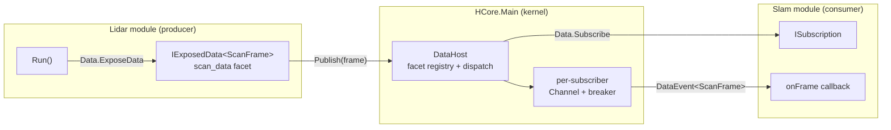

# Data Plane Guide

How a module exposes, streams, and consumes live data through HCore's data plane.

> **Design rationale:** [DATA_PLANE_DESIGN.md](DATA_PLANE_DESIGN.md) — the full debate (cell vs stream, dispatch, breaker, timing, the AFCP remote story).
> **Micro-decisions:** [DATA_PLANE_DECISIONS.md](DATA_PLANE_DECISIONS.md) — the six §B choices that shaped the API.

---

## The model in one paragraph

Data is a **facet of an ordinary module** at `/proc/<instance>/<facetName>` — not a parallel
"channel" namespace and not a separate "data module" type. A lidar module has callable methods
(`ctl`), an exposed data stream (`data`), status (`info`), and children — one module, four facets.
A producer registers a facet with `Data.ExposeData<T>(...)` and pushes frames to the handle it gets
back; a consumer reads a snapshot with `Data.ReadData<T>(path)` or receives a push stream with
`Data.Subscribe<T>(path, ...)`. Both go through the injected `Data` capability — the data-plane
"system call" surface, peer to `Vfs` (files) and `Host` (processes/IPC).



---

## The two primitives: cell vs stream

A facet is one of two primitives. The choice fixes the default dispatch policy **and** the
handler-exception policy.

| Primitive | Semantics | Right for | Overflow | Handler throws |
|-----------|-----------|-----------|----------|----------------|
| **Cell** (latest value) | holds the current value; read = current; subscribe = on-change | IMU orientation, temperature, "current scan" | coalesce to newest (drop intermediates) | one-strike-and-out |
| **Stream** (ordered queue) | ordered sequence; don't drop frames | lidar→SLAM, video | bounded queue, drop-oldest | tolerate-and-continue; trip on sustained throws |

```csharp
public enum FacetKind { Cell, Stream }
```

A cell is internally a 1-deep "latest" slot; a stream is a bounded ordered queue per subscriber.
A third primitive — a shared key-value blackboard (ROS-parameter-server style) — is a different
abstraction and is out of scope.

---

## Producing data

Call `Data.ExposeData<T>(...)` to register a facet under your own instance and get a handle you
push frames to:

```csharp
public sealed class LidarImplement : BaseImplement, ILidar, IRunnable
{
    private IExposedData<ScanFrame>? _scan;

    public void Run()
    {
        _scan = Data.ExposeData<ScanFrame>(
            "scan_data",
            FacetKind.Stream,
            formatter: FormatFrame);   // optional: how `cat` renders it

        _ = Task.Run(PublishLoop);
    }

    private async Task PublishLoop()
    {
        while (true)
        {
            var frame = new ScanFrame(...);
            _scan!.Publish(frame);     // fans out to every subscriber
            await Task.Delay(100);
        }
    }
}
```

| `ExposeData` argument | Default | Meaning |
|-----------------------|---------|---------|
| `facetName` | (required) | Leaf name; appears at `/proc/<you>/<facetName>`. Cannot contain `/`. |
| `kind` | (required) | `Cell` or `Stream` — picks the primitive. |
| `policy` | `Default` | Dispatch policy; `Default` infers from `kind` (Cell→`Coalesce`, Stream→`OrderedQueue`). |
| `bound` | `-1` (per-kind) | Per-subscriber queue bound. `-1`/0 = Cell→1, Stream→64. Ignored for `WaitForAll`. |
| `formatter` | `ToString()` | Optional `Func<T,string>` for the `cat` inspection path (see below). |

`IExposedData<T>.Set(T)` is a V2-parity alias for `Publish(T)`.

### Zero-copy contract (freeze-after-publish)

`Publish` passes the **reference** straight to subscribers — no copy on the in-process hot path.
The producer therefore **must treat the frame as immutable after publishing** and allocate a fresh
frame per publish rather than mutating a reused buffer. This is the Go-channel / Erlang-term / actor
convention. It is documented, not enforced: a producer that mutates after publish owns the resulting
torn reads. The allocation cost is negligible for typical sensor rates (a 1 kHz, 360-float scan is
~1.5 MB/s of Gen0 allocation — effectively free for modern GC). Pool/loaned messages are deferred
until a profiler demands them.

---

## Consuming data

Two access patterns, one address, both on `Data`:

### Snapshot (pull) — `ReadData<T>`

One-shot read of the **most-recent** published value. Non-draining: it peeks at the latest value
and never consumes from a queue. This is the programmatic "cat" path.

```csharp
ScanFrame? latest = Data.ReadData<ScanFrame>("/proc/lidar/scan_data");
if (latest is null) { /* producer hasn't published yet */ }
```

Returns `null` if nothing has been published yet. Throws `InvalidOperationException` if no facet
exists at the path or the facet's type is not `T`.

### Subscribe (push) — `Subscribe<T>`

The real consumer hot path. Returns a handle whose state is **always observable** (the mandatory
signal); the `onDisconnected` callback is the **optional** interruption. A consumer that never
wired a callback still discovers a trip on its next interaction by polling `.State` — no silent
footgun.

```csharp
private ISubscription? _sub;

public void Run()
{
    _sub = Data.Subscribe<ScanFrame>(
        "/proc/lidar/scan_data",
        OnFrame,
        reason => Logger.W($"scan stream disconnected: {reason}"));
}

private ValueTask OnFrame(DataEvent<ScanFrame> e, CancellationToken ct)
{
    Logger.I($"seq={e.Sequence} frame={e.Data.FrameIndex}");
    return ValueTask.CompletedTask;
}
```

The handler runs on a thread-pool worker, one frame at a time per subscription (ordered policies).
The `CancellationToken` is tripped on dispose/disconnect — check it in long handlers so you unwind
cooperatively. Return `ValueTask.CompletedTask` for a synchronous handler; `await` if you need to.

> **Order matters.** The producer must `ExposeData` before the consumer `Subscribe`s — `Subscribe`
> throws if the facet doesn't exist yet. In the shell: `run /proc/lidar` before `run /proc/slam`.

---

## The event payload — `DataEvent<T>`

Every delivered frame carries the per-facet sequence number and the publish-to-publish duration:

```csharp
public readonly struct DataEvent<T> where T : class
{
    public T Data { get; init; }                 // the frame (immutable reference)
    public long Sequence { get; init; }          // PER-FACET firing count (gap detection)
    public long? InterFrameDelta { get; init; }  // publish-to-publish duration (Stopwatch ticks)
}
```

- **`Sequence` is per-facet, not per-producer.** A subscriber to `/proc/lidar/scan_data` sees a
  contiguous sequence on *that* stream; another facet on the same producer has its own independent
  counter. A gap in `Sequence` (e.g. #5 → #8) means the **kernel** dropped frames between them.
- **`InterFrameDelta` is the rate-mismatch diagnostic.** It is a *duration* (publish-to-publish),
  not an absolute time. It earns its place because when a consumer is backed up and draining a
  queue, its measured inter-arrival times reflect its *drain* rate, not the *publish* rate — so
  `InterFrameDelta` is the one signal that reveals "producer at 5 Hz, I'm draining at 2 Hz →
  sustained mismatch," exactly the overload case the breaker exists to detect. Convert to
  milliseconds: `e.InterFrameDelta.Value * 1000.0 / Stopwatch.Frequency`. `null` on the first frame.

> **Why not `DateTime.Now`?** Wall-clock is subject to NTP jumps/leap seconds and wrecks SLAM's
> time deltas. The plane uses `Stopwatch.GetTimestamp()` — monotonic, high-resolution. Physical
> capture time (when the sensor fired) is producer-domain; put it inside the payload if you care.

---

## The subscription handle — `ISubscription`

```csharp
public interface ISubscription : IDisposable
{
    SubscriptionState State { get; }              // Active / Tripped / Disposed
    DisconnectReason? DisconnectReason { get; }   // null while Active
    long ConsumerSkippedCount { get; }            // frames skipped because the handler threw
}
```

| `State` | Meaning |
|---------|---------|
| `Active` | Receiving frames. |
| `Tripped` | The breaker fired (see below). Dead; re-subscribe to resume. |
| `Disposed` | The consumer called `Dispose()`. |

**Lifecycle rules:**
- `Dispose()` = unsubscribe. Idempotent, best-effort. It stops dispatching *new* frames and lets any
  in-flight callback finish (it does **not** block, and does **not** interrupt mid-callback — can't
  safely in .NET). The handler's `CancellationToken` is tripped so a cooperative handler unwinds.
- **Re-subscribe = call `Subscribe` again.** A tripped subscription is already dead; disposing it is
  a no-op. Re-subscribe starts **fresh** — you do *not* get the backlog you missed during the dead
  period (catch-up is a facet policy, not a reconnect behavior).
- **Backoff on re-subscribe is the consumer's job.** The kernel can't detect when you're un-stuck,
  so it must not auto-resume — and it won't impose its own backoff either.

---

## Dispatch policies

Four policies govern how `Publish` fans a frame out to subscribers. Pick one per facet at
`ExposeData` time:

| Policy | Behavior | Default for | Producer blocks? |
|--------|----------|-------------|------------------|
| `Coalesce` | fire-and-forget; if a new frame arrives while the handler runs, only the latest is kept and delivered when the handler finishes | `Cell` | no |
| `OrderedQueue` | fire-and-forget; each frame enqueued per-subscriber, drained in order; drop-oldest on overflow | `Stream` | no |
| `ParallelUnordered` | fire-and-forget; each item dispatched to a bounded-parallelism pool (independent items, order irrelevant) | — | no |
| `WaitForAll` | `Publish` blocks until every subscriber's handler finishes | — | **yes** (opt-in backpressure) |

`DispatchPolicy.Default` infers from the `FacetKind` (Cell→`Coalesce`, Stream→`OrderedQueue`).

**The producer never blocks by default.** `Coalesce`/`OrderedQueue`/`ParallelUnordered` return
immediately: each subscriber has its own bounded `Channel<T>` (the isolation unit — a slow/throwing
consumer cannot stall the producer or other subscribers) and a single consumer task on the thread
pool (the execution unit — no thread explosion, no cross-subscriber head-of-line blocking).

`WaitForAll` is the explicit backpressure policy: use it when a slow consumer *should* slow the
producer (an actuator back-pressuring a planner). It is catastrophic for a sensor (one slow consumer
stalls the driver), so it is never the default. This is the fix for V2's `Parallel.For`-in-`Set`,
which blocked the producer on every channel by accident.

---

## The circuit breaker

For sustained overload, handler failure, or producer death, the plane **fails loud** rather than
silently degrading forever. Three trip causes funnel into the same disconnect path, distinguished by
the typed `DisconnectReason`:

| `DisconnectReason` | When | Applies to |
|--------------------|------|------------|
| `Overload` | sustained queue depth (≥ bound, with hysteresis, for > 2 s) | Stream facets |
| `HandlerException` | a callback threw (Cell: one-strike; Stream: sustained throws for > 2 s) | both |
| `ProducerKilled` | the producing instance was reaped (`kill` / cascade) | both |
| `Disposed` | the consumer disposed the subscription | both |

On trip:
- `State` → `Tripped`, `DisconnectReason` is set (always pullable — the mandatory signal).
- The `onDisconnected` callback fires (the optional interruption).
- The subscriber's queue is **dropped** (leak prevention).
- The subscriber is detached from the facet. Re-subscribe to resume (fresh, no backlog).

**Why cell doesn't trip on `Overload`:** coalesce *is* the cell's rate-mismatch answer — dropping
intermediates is the design, not a fault. A cell's failure mode is a throwing/hung handler
(`HandlerException`). A stream's failure mode is sustained queue overflow — that *is* overload.

**Hysteresis:** the overload window resets only when the queue drains *well* below capacity (below
half), not on a momentary single-frame dip. Without this, a slow consumer draining one frame between
two fast publishes would reset the window on every cycle and a genuinely overloaded stream would
never trip.

**Producer death extends cascade kill.** When `ModuleHost.KillLocked` reaps a producer, every
subscriber to any of its facets receives `ProducerKilled` — even subscribers in unrelated subtrees.
Killing a producer doesn't just stop new frames; it cleanly disconnects every consumer.

---

## The `cat` inspection path

For humans and scripts, `ProcFileSystem` synthesizes a read-only file named after each facet, next
to `info`:

```
/ $ cat /proc/lidar/scan_data
frame:       8
angle_min:   -3.142
angle_max:   3.142
ranges:      [360 samples]
```

The content is the **formatter hook** (`ExposeData`'s `formatter` argument) applied to the current
value, defaulting to `ToString()`. The producer owns how its data renders for inspection — pass
`v => JsonSerializer.Serialize(v)` if you want JSON. The file is rebuilt on every access (like
`info`), so `cat` always sees the latest value. Slow, snapshot, serialized — fine for a human, wrong
for a 1 kHz consumer; the programmatic path goes through `Data`, typed and zero-copy.

**Two doors, one address:** `cat /proc/lidar/scan_data` (shell, bytes) and
`Data.ReadData<ScanFrame>("/proc/lidar/scan_data")` (code, typed) read the same facet.

---

## Cross-package type rule

`Subscribe<T>` and `ReadData<T>` are typed. For a producer in package A and a consumer in package B
(different `AssemblyLoadContext`s) to share a facet, the frame type `T` **must live in a shared
contract assembly** — `HCore.Modules.Base` or another assembly loaded once in the default context.
Different ALCs see different `Type` objects, so a package-local `ScanFrame` would make
`Subscribe<ScanFrame>` fail to match `ExposeData<ScanFrame>` across packages.

If producer and consumer are in the **same** package (same ALC), the frame type can be package-local
— that's what the demo below does. See [ARCHITECTURE.md → Assembly Isolation](ARCHITECTURE.md#assembly-isolation).

---

## Demo: `HCore.Packages.Sensor`

A worked producer/consumer pair. Build and run, then at the shell (producer first):

```
spawn HCore.Packages.Sensor.Lidar lidar
run /proc/lidar
spawn HCore.Packages.Sensor.Slam slam
run /proc/slam
cat /proc/lidar/scan_data
kill /proc/lidar
```

### Producer — `LidarImplement`

Exposes a `scan_data` stream facet and publishes synthetic frames on a background loop. `Run()`
starts the loop and returns (the instance stays alive at `/proc/lidar`); `OnKilled()` stops it.

```csharp
public sealed class LidarImplement : BaseImplement, ILidar, IRunnable
{
    private IExposedData<ScanFrame>? _scan;
    private CancellationTokenSource? _cts;

    public void Run()
    {
        _scan = Data.ExposeData<ScanFrame>("scan_data", FacetKind.Stream, formatter: FormatFrame);
        _cts = new CancellationTokenSource();
        _ = Task.Run(() => PublishLoop(_cts.Token));
    }

    private async Task PublishLoop(CancellationToken ct)
    {
        var rng = new Random();
        var index = 0;
        while (!ct.IsCancellationRequested)
        {
            var ranges = new double[360];
            for (var i = 0; i < ranges.Length; i++) ranges[i] = rng.NextDouble() * 5.0;
            _scan!.Publish(new ScanFrame(index++, -Math.PI, Math.PI, ranges));
            try { await Task.Delay(100, ct); } catch (OperationCanceledException) { break; }
        }
    }

    protected override void OnKilled() => _cts?.Cancel();
}
```

### Consumer — `SlamImplement`

Takes a snapshot (pull) before subscribing (push) — the two faces of one facet — and logs each
delivered frame with its sequence and inter-frame delta.

```csharp
public sealed class SlamImplement : BaseImplement, ISlam, IRunnable
{
    private ISubscription? _sub;

    public void Run()
    {
        var snapshot = Data.ReadData<ScanFrame>("/proc/lidar/scan_data");
        Logger.I(snapshot is null ? "no scan snapshot yet" : $"snapshot frame={snapshot.FrameIndex}");

        _sub = Data.Subscribe<ScanFrame>(
            "/proc/lidar/scan_data",
            OnFrame,
            reason => Logger.W($"scan stream disconnected: {reason}"));
    }

    private ValueTask OnFrame(DataEvent<ScanFrame> e, CancellationToken ct)
    {
        var deltaMs = e.InterFrameDelta is null ? 0.0
            : e.InterFrameDelta.Value * 1000.0 / Stopwatch.Frequency;
        Logger.I($"scan seq={e.Sequence} frame={e.Data.FrameIndex} interFrame={deltaMs:F1}ms");
        return ValueTask.CompletedTask;
    }

    protected override void OnKilled() => _sub?.Dispose();
}
```

### What you'll see

```
slam: snapshot frame=2
slam: scan seq=4 frame=3 interFrame=100.5ms
slam: scan seq=5 frame=4 interFrame=103.6ms
...
slam: scan stream disconnected: ProducerKilled    ← after `kill /proc/lidar`
```

`kill /proc/lidar` reaps the producer; the kernel fires `ProducerKilled` to the slam's subscription,
which logs the disconnect. `ls /proc` afterward shows only `slam/` — the producer, its facet, and
its `/proc` entry are all gone.

---

## Reference: the `Data` capability

`Data` is the third injected kernel handle, alongside `Vfs` and `Host`:

| Module sees | Kernel provides | Syscall group |
|-------------|-----------------|---------------|
| `Vfs : IModuleFileSystem` | `ModuleFileSystemProxy` → `FileSystem` | file calls (bytes in the mount tree) |
| `Host : IModuleHost` | `ModuleHost` | process / IPC calls (module↔module) |
| `Data : IDataHost` | `DataHost` | **data calls** (expose / read / subscribe) |

Each instance receives a `ScopedDataHost` bound to its own name (mirroring `ScopedModuleHost`) — so
`ExposeData` always registers the facet under *this* instance, and a module cannot forge another
producer's path. `ReadData`/`Subscribe` are path-based and pass straight through to the kernel.

For the full type reference, see [API_REFERENCE.md](API_REFERENCE.md#data-plane).

---

## What's not here yet (additive layers)

These are intentionally deferred — each is a clean layer on top, not a rewrite (see [TODO.md](TODO.md)):

- **Pull face** — an `await foreach` (`IAsyncEnumerable<T>`) adapter over the same per-subscriber
  queue. Push ships first; pull is a thin add-on.
- **Pool/loaned messages** — pre-allocated, ref-counted frames for huge-payload/high-rate streams.
  Ship allocate-immutable-per-frame first; add pools when a profiler demands it.
- **AFCP remote mounts** — remoteness as a path prefix (9P-style); `(Sequence, InterFrameDelta)`
  is forward-compatible and works unchanged when it arrives.
- **Capability model** — today `Data` is an all-or-nothing capability; a finer model is needed
  before remote mounts are production-safe.
